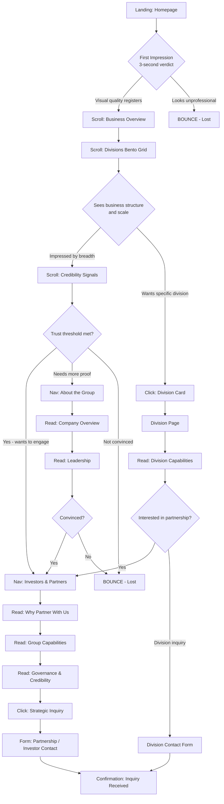
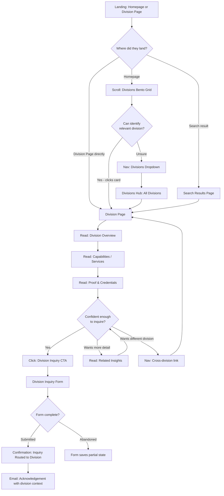
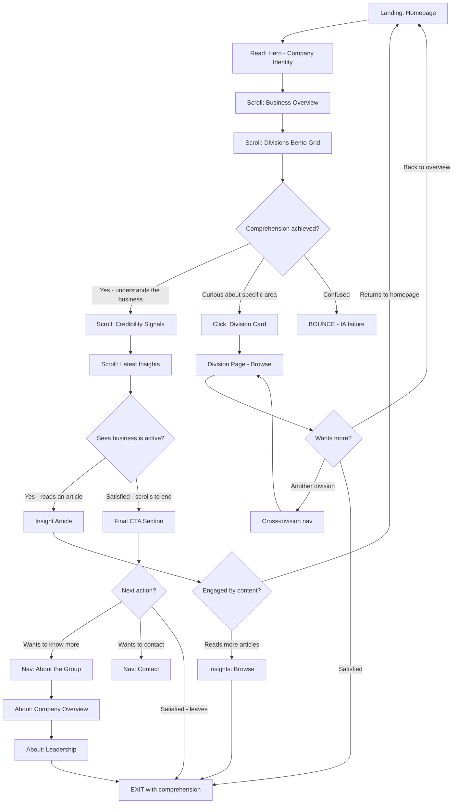
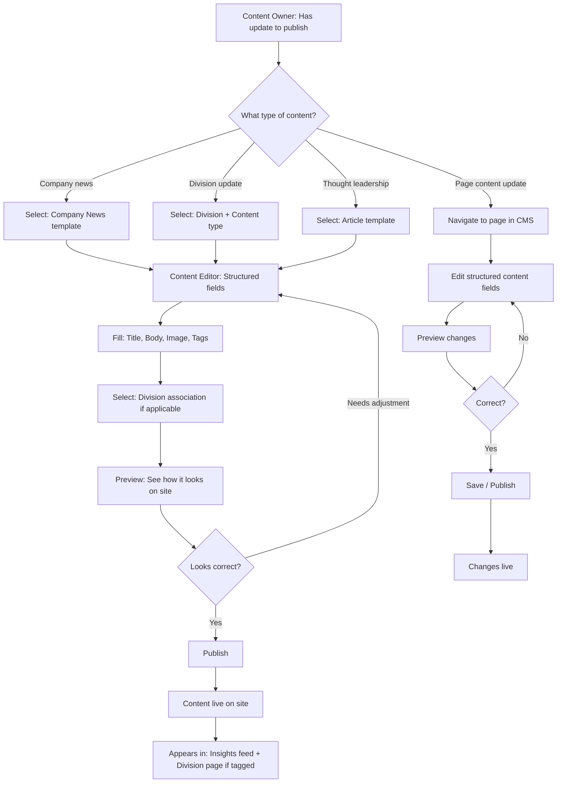

# UX Design Specification — Global Resources Citadel Limited (GRCL)

**Author:** Awwal
**Date:** 2026-03-27

---

<!-- UX design content will be appended sequentially through collaborative workflow steps -->

## Executive Summary

### Project Vision

This platform is the digital foundation for a multi-division Nigerian conglomerate operating across crop farming, animal husbandry, agro-processing, commodity marketing, real estate, importing/exporting, and oil & gas. The UX must solve a singular challenge: translating the breadth and complexity of a diversified business portfolio into an experience that feels coherent, credible, and navigable — not overwhelming.

The website is not a brochure. It is a credibility engine. Its primary job is to make the business legible to external audiences — investors, customers, and the general public — and convert that legibility into trust, inquiry, and engagement.

The experience must honour a critical strategic reality: this is a conglomerate-in-formation. Not all seven divisions carry equal operational weight. The UX architecture must encode a strategic hierarchy — core business divisions receiving dominant presence, supporting capabilities positioned as extensions, and aspirational divisions framed as forward vision rather than operational claims. Treating all seven as equals would dilute clarity and undermine credibility.

### Target Users

**Investor / Partner Visitors**
Time-poor, skepticism-first. They arrive to evaluate whether the business is structured, serious, and worth engaging. They need corporate scale communicated immediately, divisional coherence demonstrated structurally, and a clear path to partnership or inquiry conversation. The value moment: shifting from "what is this?" to "this is worth a conversation."

**Customer / Prospect Visitors**
Task-oriented. They are looking for a specific product, service, or capability within one of the business verticals. They may not understand the corporate structure and should not need to. They need to find the right division fast, understand its offering with enough depth to build confidence, and reach a division-specific inquiry path without friction. The value moment: feeling they have reached the right business unit and knowing exactly how to engage.

**General Public Visitors**
Curiosity-driven. They want to understand what this company does and whether it is legitimate. They need plain-language orientation, clear business structure, and a professional presentation that answers the question "is this real?" within a short visit. The value moment: being able to summarise the company in their own words after a single session.

**Internal Content Owners**
Operational. They need to publish company-wide and division-specific news, updates, and thought leadership content without developer support. They need a structured publishing model, clear content placement rules, and templates that preserve platform quality as content grows. The value moment: realising the platform is a living communication asset, not a frozen artifact.

### Key Design Challenges

**Complexity-to-Clarity Translation**
Seven verticals spanning agriculture to oil & gas risk creating a confusing wall of unrelated sectors. The UX must present business breadth as a strength — structured, coherent, and intentional — not as a disorienting list. Every layout decision, navigation pattern, and content hierarchy choice must reduce cognitive load while preserving the full picture.

**Strategic Division Hierarchy**
Not all divisions are equal in operational maturity, revenue significance, or content readiness. The UX must visually encode a hierarchy — core divisions commanding primary attention, supporting divisions positioned contextually, aspirational divisions framed through narrative — without making any division feel neglected or hidden.

**Multi-Audience Serving on a Single Platform**
An investor evaluating business structure and a customer looking for agricultural feed are fundamentally different users sharing the same site. Navigation architecture, homepage flow, and content organisation must serve divergent intents without forcing one audience to wade through content designed for another.

**Mobile-First Under Network Constraints**
The primary audience includes Nigerian users on mobile devices with variable bandwidth. Performance is not an enhancement — it is a credibility requirement. Heavy imagery, complex animations, and client-side rendering patterns that assume stable broadband will break the experience for the people who matter most.

**Graduated Content Depth**
Content readiness varies across divisions. Some may launch with rich case studies and detailed service descriptions. Others may have only an overview and contact pathway. The UX must support this asymmetry gracefully — no empty-feeling pages, no "coming soon" signals that undermine trust.

### Design Opportunities

**Narrative-First Homepage Architecture**
Rather than a flat grid of division tiles, the homepage should tell the story of the business. A flowing narrative that moves from corporate identity through business structure to engagement pathways — building trust progressively as the user scrolls. The user should feel the scale and coherence of the business before they consciously parse navigation labels.

**Division-as-Experience Pattern**
Each division page uses a shared structural layout system but adapts its visual personality — sector-relevant imagery, contextual iconography, and subtle colour differentiation — so it feels tailored without becoming a disconnected mini-site. Consistency of structure, individuality of expression.

**Strategic Credibility Weaving**
Numbers, certifications, operational proof points, and years of experience should not be dumped on an About page. They should be woven into the experience at the moments where trust is most needed — on division pages where a prospect is deciding whether to inquire, on the homepage where an investor is forming a first impression, at contact points where commitment is requested.

**Progressive Disclosure Architecture**
The experience respects the user's attention by revealing depth on demand. First visit: understand the business shape. Deeper exploration: discover division-level detail, case studies, thought leadership. The site never overwhelms on entry but always rewards curiosity.

## Core User Experience

### Defining Experience

The core user experience is orientation-to-action. Every visit follows the same fundamental arc: the user arrives, understands what this business is, identifies the pathway relevant to their intent, and reaches a meaningful next step — whether that is deeper exploration, inquiry, or partnership contact.

The defining interaction is not a single button click or form submission. It is the transition from confusion to clarity. For a multi-division conglomerate, the default user experience is disorientation — too many sectors, unclear relationships, no obvious entry point. This platform must invert that default. The user should experience structure, not sprawl. Coherence, not complexity.

The core action — finding the right path — must work across all four audience types without any of them needing to understand the corporate structure in advance. The investor finds credibility signals. The customer finds the right division. The public visitor finds understanding. The content owner finds publishing pathways. All from a single, unified experience architecture.

### Platform Strategy

The platform is web-first, delivered as a multi-page application with strong server-rendered or statically generated page boundaries. There is no native mobile app requirement. The experience is accessed through modern evergreen browsers on desktop and mobile devices.

Mobile-first is not a responsive afterthought — it is the primary design target. The Nigerian audience base includes significant mobile-on-variable-bandwidth usage. Every layout, interaction, and media decision must be validated against constrained network conditions first, then enhanced for desktop.

The platform is custom-coded, preserving full engineering control over structure, performance, and extensibility. No low-code or template-based CMS constraints. Content management pathways will be built into the architecture to support ongoing publishing without developer intervention, but the front-end experience is bespoke.

No offline functionality is required. No real-time features are needed for MVP. The platform prioritises fast initial page render, semantic HTML, strong metadata control, and efficient asset delivery.

### Effortless Interactions

**Division Discovery**
A user should be able to identify the relevant business division within seconds of arrival, without needing to understand the corporate hierarchy. Navigation labels, homepage flow, and visual grouping must make division discovery feel instinctive, not analytical.

**Audience-Appropriate Orientation**
An investor and a customer arrive with fundamentally different questions. The homepage must orient both without either feeling they have landed in the wrong place. This requires narrative flow and visual hierarchy that serves multiple reading patterns simultaneously — the scanner, the deep reader, and the task-driven clicker.

**Inquiry Pathways**
Reaching a contact or inquiry action should never require more than two intentional clicks from any page on the site. Division-specific inquiry paths should feel like natural endpoints of the content flow, not bolted-on afterthoughts.

**Cross-Division Navigation**
Moving between divisions should feel like moving through rooms of the same building, not switching between disconnected websites. Consistent structural patterns, persistent navigation context, and visual continuity must make cross-division browsing seamless.

**Content Consumption**
Reading company news, division updates, and thought leadership content should feel clean and uncluttered. No visual noise competing with the content. Typography, spacing, and layout must make long-form reading comfortable on mobile screens.

### Critical Success Moments

**The Three-Second Verdict**
The user's first impression forms in under three seconds. In that window, the visual quality must register as premium and the business identity must be immediately legible. If the site looks generic, dated, or confusing in that window, the user has already decided this is not a serious business. This is the single highest-stakes moment in the entire experience.

**The "I Know Where to Go" Moment**
Within the first scroll or navigation interaction, the user should know exactly where to go next for their specific intent. This moment is the proof that the information architecture works. If it does not arrive quickly, the user begins clicking randomly or leaves.

**The Division Confidence Moment**
When a user reaches a division page, they must feel they have arrived somewhere substantive — not a placeholder, not a copy-paste template with swapped keywords. The page must communicate competence, relevance, and a clear next step specific to that vertical.

**The Inquiry Commitment Moment**
When a user decides to make contact, the inquiry experience must reinforce the professionalism established by everything before it. A sloppy form, unclear submission feedback, or a generic "we'll get back to you" message would undermine the trust the entire site worked to build.

### Experience Principles

**Clarity Over Cleverness**
Every design decision should prioritise immediate comprehension over aesthetic novelty. If a layout, animation, or interaction pattern makes the user pause to decode it, it has failed — regardless of how visually impressive it is.

**Aesthetic Authority**
Visual quality is not decoration. It is the primary credibility signal. The platform must look and feel like it belongs to a serious, professionally run organisation. Every typographic choice, colour decision, spacing rule, and image treatment must reinforce authority and premium quality.

**Structure Communicates Scale**
The way the site is organised should itself communicate that this is a large, structured, multi-division business. The information architecture is not just a navigation convenience — it is a business communication tool. Structure is the message.

**Performance Is Respect**
Fast loading is not a technical metric. It is a signal of respect for the user's time and network conditions. A site that loads slowly on mobile tells the user their context does not matter. Performance is how the platform says "we built this for you."

**Depth Without Overwhelm**
The site must offer substance for users who want it without forcing it on users who do not. Progressive disclosure, clean hierarchy, and intentional content density ensure that every user gets exactly the level of depth they need — no more, no less.

## Desired Emotional Response

### Primary Emotional Goals

**Trust — "This is legitimate"**
The dominant emotional response the platform must generate is trust. Every visual decision, content structure, and interaction pattern must converge on a single user conclusion: this is a professionally run, operationally real, commercially serious business. Trust is not built by claiming credibility — it is built by demonstrating it through quality of execution.

**Clarity — "I understand this"**
The second emotional goal is comprehension without effort. A user visiting a 7-division conglomerate site should never feel they are decoding a puzzle. The business structure, division relationships, and navigation pathways must produce an immediate sense of "I get it." Clarity is what separates this platform from every competitor whose complexity overwhelms their audience.

**Respect — "This was built for me"**
The user should feel that the platform respects their context — their time, their device, their bandwidth, their intent. Fast loading, clean layout, accessible interactions, and intuitive navigation are not features. They are signals that the business understands its audience and values their experience.

**Impression — "This is better than expected"**
The platform should exceed the user's reference frame for what a Nigerian conglomerate website looks like. Not through flashy gimmicks, but through the quiet authority of premium design, thoughtful structure, and polished execution. The feeling of "this is different" should arrive before the user can articulate why.

### Emotional Journey Mapping

**First Contact (Landing)**
Feeling: Immediate visual confidence. The user registers quality before reading a word. The aesthetic authority of the homepage communicates seriousness in under three seconds. No confusion about what kind of business this is.

**Orientation (First Scroll / Navigation)**
Feeling: Relief through structure. The user sees the business laid out clearly — divisions organised, pathways visible, hierarchy intuitive. The overwhelming complexity of a multi-sector business resolves into a navigable map. The user thinks: "I know where to go."

**Exploration (Division Pages / Content)**
Feeling: Substantive confidence. Each division page reinforces that this is a real operation, not a facade. Content has depth. Visual treatment is tailored but consistent. The user feels they are exploring a coherent business, not clicking through disconnected brochures.

**Action (Inquiry / Contact)**
Feeling: Professional assurance. The inquiry experience matches the quality of everything before it. The form is clean, the context is clear, the confirmation is professional. The user commits to contact feeling confident their inquiry will be taken seriously.

**Return (Repeat Visit)**
Feeling: Familiarity and freshness. The structure is remembered. Navigation feels natural. But new content — news, updates, thought leadership — signals that the business is alive and active. The platform rewards return visits without disorienting the returning user.

### Micro-Emotions

**Confidence over Confusion**
The most critical emotional axis. If a user ever feels confused about where they are, what this business does, or how to reach the next step, every visual investment is wasted. Confidence must be maintained at every interaction point — navigation, page transitions, content hierarchy, and call-to-action placement.

**Trust over Skepticism**
The platform's entire purpose as a credibility engine depends on this axis. Trust is built through consistency — visual consistency, structural consistency, quality consistency. Any element that feels mismatched, hastily produced, or out of character introduces skepticism that spreads to the user's perception of the business itself.

**Accomplishment over Frustration**
When a user finds the division they need, locates the contact pathway, or understands the business structure, the feeling should be effortless satisfaction — not relief after a struggle. The site should make users feel smart for navigating it, not exhausted by having survived it.

**Engagement over Indifference**
The platform should hold attention through visual interest, narrative flow, and content relevance — not through friction or dark patterns. Users stay because the experience rewards their attention, not because they cannot find the exit.

### Design Implications

**Trust → Visual Consistency System**
A strict design system with consistent typography, colour application, spacing rhythm, and component behaviour across every page. No one-off treatments. No inconsistent styling between divisions. Visual consistency is the foundation of trust.

**Clarity → Information Architecture Discipline**
Navigation labels must be immediately understandable. Page hierarchy must follow predictable patterns. Content sections must have clear boundaries. The user should never need to guess what a link leads to or what section they are reading.

**Respect → Performance-First Engineering**
Images optimised for mobile bandwidth. Minimal client-side JavaScript. Fast server response. Efficient font loading. Every technical decision evaluated against the question: "Does this respect the user's device and network conditions?"

**Impression → Premium Visual Execution**
Refined typography with deliberate scale and weight hierarchy. Considered whitespace that lets content breathe. High-quality imagery with consistent treatment. Subtle, purposeful motion that adds polish without degrading performance. The visual standard should feel like it belongs to a business that invests in quality.

**Confidence → Predictable Interaction Patterns**
No surprising navigation behaviours. No modal interruptions. No auto-playing media. No layout shifts during loading. Every interaction should behave exactly as the user expects. Predictability is the UX expression of confidence.

### Emotional Design Principles

**Earned Trust, Not Claimed Trust**
The platform never tells users to trust it. It earns trust through execution quality. Professional photography over stock images. Specific operational details over vague claims. Consistent design language over patchwork styling. Trust is demonstrated, not declared.

**Calm Authority**
The emotional register is confident and composed — never loud, never desperate, never overselling. The design should feel like a well-dressed professional who does not need to raise their voice to command a room. Authority through restraint.

**Warmth Within Structure**
Corporate authority must not become cold distance. The platform should feel human within its professional framework — approachable language where appropriate, real imagery where possible, and a tone that balances organisational scale with genuine engagement. The business is serious, but it is also made of people.

**Invisible Effort**
The experience should feel effortless to the user, even though enormous design and engineering effort makes that effortlessness possible. The best UX is the UX nobody notices — because everything simply works as expected.

## UX Pattern Analysis & Inspiration

### Inspiring Products Analysis

**OSLSR — Oyo State Labour & Skills Registry (oyotradeministry.com.ng)**
A previous project built by this team. This is the primary design language reference for the conglomerate platform. The site demonstrates proven patterns for clean, modern, accessible web design with strong mobile-first execution.

**What OSLSR Does Well:**

The site establishes trust through visual restraint. A Poppins/Inter typography pairing delivers modern readability without trying too hard. The colour system is disciplined — a single maroon/burgundy accent (#9C1E23) used sparingly against a cool neutral grey scale, with alternating white and neutral-50 section backgrounds that create visual rhythm without visual noise.

The spacing system is generous and consistent. Every section uses py-16 lg:py-24 vertical padding with container mx-auto px-4 sm:px-6 lg:px-8 horizontal containment. Content is constrained to max-w-3xl or max-w-4xl where appropriate, preventing text from stretching into unreadable line lengths. This breathing room is a signature quality — the design communicates confidence through whitespace.

The homepage architecture follows a clear narrative flow across 9 sections: Hero → Explanation → Audience Cards → Process Steps → Requirements → Coverage → Preview → Trust → Final CTA. Each section has a single job, uses a consistent SectionWrapper with background variant alternation, and is introduced by a standardised SectionHeading component. Below-fold sections are lazy-loaded for performance.

The navigation is professional without being complex: sticky header with backdrop blur, dropdown menus on desktop with label + description pairs, and a slide-in Sheet drawer on mobile with expandable accordion sections and a pinned CTA at the bottom. This pattern handles information depth without overwhelming the user.

The component system is reusable and disciplined. FeatureCards use icon-in-circle → title → description → arrow-link patterns with hover elevation. StepIndicators use numbered badges with connecting lines that shift from horizontal (desktop) to vertical (mobile). Every interactive element has focus-visible rings and proper aria attributes.

**What Needs Evolution for the Conglomerate:**

OSLSR serves a single initiative with a linear user journey. The conglomerate serves multiple audiences across seven business divisions. The patterns are proven — but the information architecture must scale dramatically. The navigation needs to handle division-level depth. The card patterns need to express division identity, not just feature differentiation. The section flow needs to tell a multi-sector business narrative, not a single-product story.

### Transferable UX Patterns

**Navigation Patterns:**

- **Sticky header with backdrop blur** — directly transferable. Provides persistent orientation across a deep multi-page site without feeling heavy. The blur effect maintains visual context when scrolling.
- **Dropdown menus with label + description** — adaptable for division navigation. Each division entry can show the division name and a one-line descriptor, helping users identify the right vertical without guessing from a bare label.
- **Mobile Sheet drawer with accordion sections** — directly transferable with expansion. Division groups can be organised as collapsible sections within the mobile drawer, preventing a flat list of 20+ navigation items.
- **Pinned CTA at bottom of mobile nav** — adaptable as a persistent "Contact" or "Find Your Division" action in the mobile drawer.

**Section Patterns:**

- **SectionWrapper with background alternation** — directly transferable. The white/neutral-50/dark variant system creates visual rhythm across long-scrolling pages. For the conglomerate, a primary variant (using the corporate accent colour) can be added for key brand moments.
- **SectionHeading with optional subtitle** — directly transferable. Consistent heading treatment across every page section ensures structural predictability.
- **Narrative homepage flow** — adaptable. OSLSR's linear 9-section flow becomes the conglomerate's story-driven homepage: Corporate Identity → Business Scale → Division Overview → Credibility Signals → News/Thought Leadership → Contact/Inquiry CTA.
- **Final CTA section on dark background** — directly transferable. A strong closing section with dark background, clear heading, and single CTA creates a definitive call to action before the footer.

**Card Patterns:**

- **FeatureCard with icon + title + description + arrow link** — adaptable as DivisionCard. Each card represents a business vertical with sector-specific iconography, division name, brief descriptor, and "Explore Division" link. Hover elevation and border colour shift provide interactive feedback.
- **3-column responsive grid** — adaptable. Division cards can use a responsive grid that shows 1 column on mobile, 2 on tablet, 3-4 on desktop, accommodating 7 divisions without forcing an awkward layout.

**Step/Process Patterns:**

- **StepIndicator with numbered badges and connectors** — adaptable for "How We Work" or engagement process sections. Can show the journey from inquiry to partnership with visual step progression.

**Trust Patterns:**

- **Trust section with badges and compliance markers** — directly transferable. The conglomerate can display certifications, regulatory badges, years of operation, and partnership logos in the same centred-badges-plus-statement pattern.

**Footer Pattern:**

- **Multi-column footer with categorised links** — directly transferable with expansion. The 6-column grid scales naturally: About, Divisions, News, Support, Legal, Connect. The brand + tagline row at top and bottom bar with copyright provide a professional anchor.

**Performance Patterns:**

- **Lazy-loaded below-fold sections** — directly transferable. Critical for mobile-on-variable-bandwidth scenarios in the Nigerian market. Only the hero and first content section load eagerly; everything else loads on demand.

### Anti-Patterns to Avoid

**The Flat Division Grid**
Presenting all 7 divisions as equal-sized tiles in a flat grid with no hierarchy. This is the default corporate conglomerate pattern and it fails because it forces the user to scan all 7 options with no guidance on which is most relevant or most established. The OSLSR card pattern works because it presents 3 clearly differentiated audience types. 7 undifferentiated division tiles would create decision paralysis.

**The Mega-Menu Monster**
Cramming every division page, sub-page, and content item into a massive dropdown menu. This overwhelms users on desktop and is nearly unusable on mobile. The OSLSR dropdown pattern with label + description works because each dropdown contains 3-6 focused items. The conglomerate navigation should use a similar approach — division groups with concise sub-navigation, not exhaustive page trees.

**The Carousel of Ambiguity**
Using a rotating hero carousel to showcase all 7 divisions on the homepage. Carousels have consistently poor engagement — users rarely click past the first slide, and auto-rotation creates accessibility issues. The OSLSR hero succeeds because it has one clear message with one clear action. The conglomerate homepage should use narrative scroll flow, not rotational display.

**The Stock Photo Wall**
Filling division pages with generic stock photography of farms, buildings, and oil rigs. This immediately signals inauthenticity to Nigerian audiences who know what real operations look like. The OSLSR approach of using minimal imagery with strong typography and structured content is more trustworthy than fake visual richness.

**The "Coming Soon" Epidemic**
Launching division pages with placeholder content and "Coming Soon" labels. This actively damages credibility. If a division is not ready for substantive content, it should be presented as a brief overview within the divisions listing — not as an empty page that promises content it cannot deliver.

**The Disconnected Division Experience**
Making each division page feel like an entirely different website with unique layouts, colours, and navigation patterns. This fractures trust and makes the business feel incoherent. The OSLSR approach of consistent component patterns with variant styling is the correct model — same structural DNA, adapted visual expression.

### Design Inspiration Strategy

**What to Adopt Directly:**

- Poppins/Inter typography pairing — proven readable, modern, clean
- SectionWrapper pattern with consistent padding and background alternation
- SectionHeading pattern with standardised H2 treatment
- Sticky header with backdrop blur
- Mobile Sheet drawer with accordion navigation
- FeatureCard component structure (icon + title + description + arrow link)
- Trust section pattern with badges and compliance markers
- Final CTA section on dark background
- Footer with multi-column categorised links
- Lazy-loaded below-fold sections for performance
- Focus-visible accessibility patterns throughout
- Single H1 per page, semantic heading hierarchy

**What to Adapt:**

- **Bento grid layout for division presentation** — The homepage divisions section should use a Bento grid where card sizes encode strategic hierarchy. Core revenue-driving divisions get larger cards with more visual real estate and richer content. Supporting divisions get standard-sized cards. Aspirational divisions get compact treatments. This replaces the flat equal-weight grid anti-pattern and naturally communicates business structure through visual weight. The Bento grid collapses to a single column on mobile with core divisions appearing first (largest), preserving hierarchy through order and card height.
- Navigation dropdowns from simple lists to division-aware groupings with sector descriptions
- Hero from single-message CTA to narrative-driven corporate identity statement with audience-aware entry paths
- Section flow from single-product linear story to multi-sector business narrative
- **Colour system: deep forest green primary with warm gold secondary** — replacing the OSLSR maroon. Primary accent scale anchored at #15803D (primary-600) with a full range from primary-900 (#14532D) through primary-50 (#F0FDF4). Secondary gold accent (#B48A3E) for premium moments — certification badges, key statistics, awards, section dividers. The green connects to the agricultural core of the business (4 of 7 divisions), signals growth and prosperity, and carries Nigerian national identity. Combined with cool grey neutrals, it delivers the "calm authority" emotional register defined in Step 4.
- Footer from 6 general columns to division-inclusive column structure

**What to Avoid:**

- Equal-weight division grids that create decision paralysis
- Mega-menus that overwhelm navigation
- Carousels that hide content behind rotation
- Generic stock photography that undermines authenticity
- Placeholder pages that damage credibility
- Inconsistent division page layouts that fracture trust
- Heavy client-side rendering that degrades mobile performance on constrained networks

### Companion Documents

The detailed Information Architecture specification — including navigation wireframes, complete route maps, per-page content specifications, and the Bento grid layout for divisions — is maintained as a separate companion document at `_bmad-output/planning-artifacts/information-architecture.md`. That document provides the structural implementation detail that developers and content architects will work from directly. This UX specification provides the experience design rationale and visual system that the IA implements.

## Design System Foundation

### Design System Choice

**Tailwind CSS + shadcn/ui** — a themeable utility-first CSS framework paired with unstyled, accessible component primitives built on Radix UI.

This is the same foundational stack proven on the OSLSR project (oyotradeministry.com.ng). The team has direct production experience with this system, the patterns transfer directly, and the approach delivers custom visual quality without custom framework overhead.

### Rationale for Selection

**Proven Team Expertise**
The OSLSR project was built on this exact stack. Every pattern established there — SectionWrapper, SectionHeading, FeatureCard, StepIndicator, NavigationMenu, Sheet drawer, Card — was implemented in Tailwind + shadcn/ui. The team has zero learning curve and a library of validated patterns to draw from.

**Custom Appearance Without Custom Cost**
shadcn/ui components are unstyled primitives that the team owns directly (copied into the project, not imported from a package). This means every component can be themed with the deep green/gold colour system without fighting a pre-existing design language. The conglomerate site will look and feel bespoke — not like a template using a well-known component library.

**Accessibility Built In**
shadcn/ui uses Radix UI primitives under the hood. Keyboard navigation, focus trapping, ARIA attributes, screen reader support, and accessible dropdown/dialog/sheet behaviour come built-in. This directly serves the WCAG 2.1 compliance requirement without additional accessibility engineering.

**Performance Characteristics**
Tailwind CSS purges unused styles at build time, producing minimal CSS bundles. No design system runtime overhead. No massive component library download. Combined with lazy-loaded below-fold sections, this delivers the fast-loading mobile experience required for Nigerian audiences on variable bandwidth.

**Bento Grid Native Support**
Tailwind's CSS Grid utilities provide all the layout primitives needed for the Bento grid division presentation. No additional grid library required. Responsive Bento behaviour (collapsing to single column on mobile with hierarchy preserved through order and card height) is handled through standard Tailwind breakpoint utilities.

**Extensibility**
The utility-first approach means new components and patterns can be added incrementally without modifying a global design system configuration. As the platform grows — new divisions, new page types, new content patterns — the system scales through composition rather than configuration.

### Implementation Approach

**Component Architecture:**

The component system will follow the same layered approach proven on OSLSR:

1. **Primitive Layer** — shadcn/ui components (Card, Button, NavigationMenu, Sheet, Accordion, Tabs, Input, Label, Select, etc.) providing accessible interaction primitives
2. **Pattern Layer** — Project-specific composed components built from primitives:
   - `SectionWrapper` — consistent section container with background variants (white, light, dark, primary)
   - `SectionHeading` — standardised H2 treatment with optional subtitle
   - `DivisionCard` — adapted FeatureCard with Bento sizing variants (large, standard, compact)
   - `DivisionBentoGrid` — responsive Bento layout for division presentation
   - `CredibilityBar` — trust signals, certifications, and proof points
   - `InquiryForm` — division-aware contact form with routing logic
   - `InsightCard` — article preview with category, date, and division tagging
   - `StepIndicator` — numbered process visualisation with connectors
3. **Template Layer** — Page-level layout compositions:
   - Homepage template (narrative flow with Bento grid)
   - Division page template (consistent 5-section structure)
   - Insights listing and article templates
   - Contact routing template
   - Corporate content template (About, Investors & Partners)

**Design Token System:**

All visual decisions will be encoded as Tailwind theme tokens in a central configuration:

- Colour scales (primary green, secondary gold, neutrals, semantics)
- Typography (Poppins brand font, Inter UI font, size/weight/leading scales)
- Spacing rhythm (section padding, component gaps, content margins)
- Border radius, shadow, and transition values
- Breakpoint definitions (mobile-first: sm, md, lg, xl)

**Component Ownership:**

All shadcn/ui components are copied into the project source — not imported from node_modules. This means:
- Full control over component markup and styling
- No dependency update risk breaking visual consistency
- Components can be modified without forking a library
- The team owns every line of UI code

### Customisation Strategy

**Colour System Override:**

The Tailwind theme will replace the OSLSR maroon palette with the deep forest green primary scale:

| Token | Value | Usage |
|-------|-------|-------|
| primary-900 | #14532D | Footer backgrounds, heavy emphasis |
| primary-700 | #166534 | Hover states, active navigation |
| primary-600 | #15803D | Core accent — CTAs, links, active UI |
| primary-500 | #16A34A | Secondary actions, progress indicators |
| primary-300 | #86EFAC | Hover backgrounds, light badges |
| primary-100 | #DCFCE7 | Card icon backgrounds, subtle highlights |
| primary-50 | #F0FDF4 | Hero gradient tint, section backgrounds |

Secondary gold accent (#B48A3E) for premium moments: certification badges, key statistics, awards, featured content markers.

Neutral scale retained from OSLSR: #1F2937 (900) through #F9FAFB (50).

**Typography System:**

| Role | Font | Sizes | Weight |
|------|------|-------|--------|
| Brand/Headings | Poppins | H1: 4xl-6xl, H2: 3xl-4xl, H3: lg-xl | 600 (semibold) |
| UI/Body | Inter | Body: lg (18px), Small: sm (14px) | 400 (regular), 500 (medium) |
| Mono (code/data) | JetBrains Mono | sm | 400 |

**Spacing Rhythm:**

Consistent with OSLSR's proven spacing:
- Section vertical padding: `py-16 lg:py-24`
- Section heading margin: `mb-10 lg:mb-12`
- Container: `container mx-auto px-4 sm:px-6 lg:px-8`
- Content max-width: `max-w-3xl` (text), `max-w-4xl` (mixed), `max-w-7xl` (full)
- Card grid gaps: `gap-6 lg:gap-8`
- Component internal padding: `p-6` (cards), `px-8 py-4` (buttons)

**Division-Specific Accents:**

Within the consistent green/neutral framework, each division cluster can carry a subtle secondary tint for visual differentiation on division pages — applied only to accent elements (icon backgrounds, section highlights), never to primary UI or navigation. This preserves brand consistency while giving each division a sense of tailored identity:

- Agriculture & Processing: earth/amber tint
- Trade & Markets: warm/copper tint
- Built Environment & Energy: slate/steel tint

These are accent whispers, not competing colour systems.

## Defining Experience

### The Core Interaction

**"Understand this entire business in one scroll."**

The defining experience of this platform is passive comprehension through narrative scroll. A visitor lands on the homepage and, within a single continuous scroll — without clicking, navigating, or decoding — understands what this business is, how it is structured, which divisions are most established, and where to go next.

This is the interaction that, if nailed, makes everything else follow. Every page, component, and navigation pattern exists to extend and deepen the understanding that the homepage delivers in those first seconds.

Most multi-division corporate websites force users to actively hunt for comprehension — clicking through About pages, reading mission statements, decoding organisational charts, browsing division lists. This platform inverts that model. Comprehension is delivered to the user through visual hierarchy, narrative flow, and structured content. The user does not work for understanding. The homepage gives it to them.

If a visitor can explain this business to someone else after a single homepage visit, the defining experience has succeeded.

### User Mental Model

**Investor / Partner Mental Model**
Investors arrive with a filter mindset: "Is this business real, structured, and worth my time?" They expect to have to hunt for evidence — digging through pages, looking for proof points, assessing whether the business has substance behind its claims. Their mental model is investigative.

The defining experience subverts this by front-loading credibility signals. The Bento grid division layout communicates business structure visually. The credibility section delivers proof points (years of operation, certifications, partnerships) within the homepage scroll. The investor's investigation is completed before they open the navigation menu. Their mental model shifts from "let me dig" to "they've already shown me."

**Customer / Prospect Mental Model**
Customers arrive with a search mindset: "Where is the thing I need?" They expect to use navigation or search to find the right division, then evaluate whether the business can serve them. Their mental model is task-oriented and linear.

The defining experience accelerates this by making division discovery visual and immediate. The Bento grid presents all seven divisions in a single viewport with clear labels, brief descriptors, and direct links. The customer identifies their division within the homepage scroll — before they need to engage with navigation menus or search. Their mental model shifts from "let me find it" to "I can already see it."

**General Public Mental Model**
Public visitors arrive with an orientation mindset: "What is this company?" They expect to be confused — multi-sector businesses are inherently complex, and most corporate websites confirm that expectation with jargon, fragmented navigation, and unclear hierarchy. Their mental model is tentative and patience-limited.

The defining experience resolves this by telling a story. The homepage narrative flows from corporate identity ("who we are") through business structure ("what we do across seven divisions") to engagement pathways ("how to connect"). The public visitor's confusion is replaced by comprehension within a single scroll. Their mental model shifts from "I don't get it" to "I get it — this is a serious, multi-sector business."

**Internal Content Owner Mental Model**
Content owners operate with a maintenance mindset: "How do I keep this alive?" They expect the platform to be fragile — that publishing new content risks breaking layout, confusing navigation, or degrading quality. Their mental model is cautious.

The defining experience for internal users is structural predictability. Consistent page templates, standardised content components, and clear publishing pathways mean that adding new content extends the platform without disrupting it. Their mental model shifts from "what will break?" to "I know exactly where this goes."

### Success Criteria

**Comprehension Speed**
A first-time visitor can describe what the company does and how its divisions are structured after a single homepage visit lasting under 60 seconds. This is the primary measurable signal that the defining experience works.

**Navigation Efficiency**
A customer seeking a specific division reaches the correct division page within 10 seconds of landing on the homepage. This includes both direct navigation clicks and Bento grid card interactions.

**Credibility Conversion**
An investor or partner visitor encounters sufficient trust signals within the homepage scroll to justify deeper exploration or direct inquiry. The homepage alone should move the visitor from skepticism to interest.

**Screenshot Moment**
The divisions Bento grid section is visually striking enough that a visitor would screenshot it and share it — with a colleague, partner, or decision-maker. This is the organic credibility signal that validates both design quality and business communication.

**Zero Confusion Navigation**
No visitor should need to click "Back" because they arrived at a page they did not expect. Navigation labels, division descriptions, and page hierarchy should produce predictable outcomes on every click.

**Return Visit Familiarity**
A returning visitor should feel immediate familiarity with the site structure while encountering fresh content (news, insights, updates) that signals the business is alive and active.

### Pattern Analysis

**Established Patterns Used:**
The defining experience is built entirely on proven, user-familiar patterns. No novel interaction design is required. No user education is needed. The innovation lives in how established patterns are combined and applied to a specific problem — presenting a complex multi-sector business with immediate clarity.

- **Narrative scroll** — long-form homepage with sequential sections, each with a single purpose. Users understand scrolling. The pattern is universal.
- **Bento grid** — asymmetric card layout with varied sizes encoding visual hierarchy. Popularised by Apple, Linear, and Stripe. Increasingly familiar to web audiences. Naturally communicates that some items are more prominent than others.
- **Card architecture** — icon + title + description + link. The most established content presentation pattern on the web. Users know how to scan and interact with cards without instruction.
- **Sticky navigation** — persistent header providing orientation and quick access. A universal web convention that requires zero learning.
- **Dropdown menus with descriptions** — label + one-line description pairs in navigation dropdowns. Common in SaaS and corporate sites. Helps users identify the right destination without guessing from bare labels.
- **Dark section CTA** — high-contrast closing section with clear call-to-action. A proven conversion pattern for long-scrolling pages.

**What Is Novel:**
The novelty is not in the patterns — it is in the information architecture strategy. Using a Bento grid to encode division hierarchy (core, supporting, aspirational) as visual weight is an unusual application of an established layout pattern. Most corporate sites present divisions as equals. This platform uses card size as a communication tool, telling the user which parts of the business are most established without saying a word. That is the design innovation — and it requires no user education because the visual hierarchy speaks for itself.

### Experience Mechanics

**1. Initiation — The Landing Moment**
The user arrives at the homepage. The hero section fills the viewport with a corporate identity statement — the company name, a one-line positioning statement, and a subtle gradient background in the primary green. No carousel. No video autoplay. No animation demanding attention. Just clear, confident, premium text on a clean background. Two CTAs below: primary ("Explore Our Divisions") and secondary ("Partner With Us").

The user's first action is natural: they scroll.

**2. Interaction — The Narrative Scroll**
As the user scrolls, sections unfold in sequence:

- **Business Overview** — a concise explanation of what this company does across seven verticals. Constrained to max-w-3xl, centred, with generous spacing. The user reads one paragraph and understands the business scope.
- **Divisions Bento Grid** — the signature moment. Seven division cards arranged in a Bento layout. Core divisions (largest cards) occupy dominant visual real estate with richer content — icon, name, brief descriptor, key stat, and "Explore" link. Supporting divisions (standard cards) provide clear representation. Aspirational divisions (compact cards) signal presence without overclaiming. The user sees the entire business structure in a single viewport.
- **Credibility Signals** — numbers (years of operation, projects, reach), certification badges, and trust markers presented in a clean horizontal or grid layout. The user absorbs proof points without being asked to read a case study.
- **Latest Insights** — recent news and thought leadership cards showing the business is active and current.
- **Final CTA** — dark background, clear heading, single inquiry button. The closing conversion moment.

The system responds to scrolling with lazy-loaded sections that appear instantly on modern connections and gracefully on constrained bandwidth.

**3. Feedback — Understanding Confirmation**
The user knows the experience is working because:
- Each section has a clear heading that confirms what they are looking at
- The Bento grid makes business structure visually self-evident
- Navigation labels match the content they have already seen during scroll
- Clicking a division card takes them exactly where they expected
- The site loads fast and feels responsive — no waiting, no layout shifts

**4. Completion — The Comprehension Outcome**
The user reaches the footer having scrolled through the entire homepage. They now understand:
- What the company is
- How many divisions it has and which are most prominent
- Whether the business is credible
- Where to go next for their specific intent

From here, the user either:
- Clicks into a division page for deeper exploration
- Navigates to Investors & Partners for strategic engagement
- Uses the contact pathway for direct inquiry
- Leaves the site with a clear understanding of the business (which is itself a success — they may return, refer, or remember)

The defining experience is complete. Every subsequent page interaction deepens the comprehension that the homepage established.

## Visual Design Foundation

### Colour System

**Brand Guidelines Status:** No existing brand guidelines. The colour system defined here establishes the brand foundation for both digital platform and print collateral.

**Primary Palette — Deep Forest Green**

| Token | Hex | Contrast on White | Usage |
|-------|-----|-------------------|-------|
| primary-900 | #14532D | 12.6:1 AAA | Footer, dark backgrounds, heavy emphasis |
| primary-700 | #166534 | 10.1:1 AAA | Hover states, active navigation items |
| primary-600 | #15803D | 7.2:1 AAA | Core accent — CTAs, links, interactive UI, focus rings |
| primary-500 | #16A34A | 4.8:1 AA | Secondary actions, progress indicators |
| primary-300 | #86EFAC | 1.4:1 (decorative only) | Hover backgrounds, light badges, decorative accents |
| primary-100 | #DCFCE7 | 1.1:1 (background only) | Card icon backgrounds, subtle highlights |
| primary-50 | #F0FDF4 | 1.0:1 (background only) | Hero gradient tint, alternating section backgrounds |

**Secondary Accent — Warm Gold**

| Token | Hex | Usage |
|-------|-----|-------|
| gold-600 | #B48A3E | Certification badges, key statistics, awards, premium moments |
| gold-400 | #D4A84B | Hover state for gold elements |
| gold-100 | #FDF6E3 | Subtle gold tint backgrounds |

**Neutral Scale**

| Token | Hex | Role |
|-------|-----|------|
| neutral-900 | #1F2937 | Primary text, dark backgrounds |
| neutral-700 | #374151 | Secondary headings, emphasis text |
| neutral-600 | #4B5563 | Body text on light backgrounds |
| neutral-500 | #6B7280 | Muted text, timestamps, metadata |
| neutral-300 | #D1D5DB | Borders, dividers, card outlines |
| neutral-200 | #E5E7EB | Subtle borders, skeleton loaders |
| neutral-100 | #F3F4F6 | Input backgrounds, hover states |
| neutral-50 | #F9FAFB | Alternating section backgrounds, page backgrounds |

**Semantic Colours**

| Role | Hex | Usage |
|------|-----|-------|
| success-600 | #15803D | Confirmation, active status, verified badges |
| success-100 | #DCFCE7 | Success backgrounds |
| warning-600 | #D97706 | Alerts, attention-needed states |
| warning-100 | #FEF3C7 | Warning backgrounds |
| error-600 | #DC2626 | Errors, validation failures |
| error-100 | #FEE2E2 | Error backgrounds |
| info-600 | #0284C7 | Informational states, links in content |
| info-100 | #E0F2FE | Information backgrounds |

**Division Cluster Accents**

Subtle secondary tints applied only to icon backgrounds and section highlights on division pages. These never override the primary green system or navigation colours:

- Agriculture & Processing: amber-100 (#FEF3C7) background, amber-600 (#D97706) icon
- Trade & Markets: copper-100 (#FFF1E6) background, copper-600 (#C2590A) icon
- Built Environment & Energy: slate-100 (#F1F5F9) background, slate-600 (#475569) icon

### Typography System

**Font Stack**

| Role | Family | Fallback | Source |
|------|--------|----------|--------|
| Brand (headings) | Poppins | system-ui, sans-serif | Google Fonts |
| UI (body/interface) | Inter | system-ui, sans-serif | Google Fonts |
| Monospace (data) | JetBrains Mono | ui-monospace, monospace | Google Fonts |

**Type Scale**

| Level | Mobile | Desktop | Weight | Line Height | Letter Spacing | Font |
|-------|--------|---------|--------|-------------|----------------|------|
| H1 | 2.25rem (36px) | 3.75rem (60px) | 600 | 1.1 | -0.02em | Poppins |
| H2 | 1.875rem (30px) | 2.25rem (36px) | 600 | 1.2 | -0.01em | Poppins |
| H3 | 1.25rem (20px) | 1.5rem (24px) | 600 | 1.3 | 0 | Poppins |
| H4 | 1.125rem (18px) | 1.25rem (20px) | 600 | 1.4 | 0 | Poppins |
| Body | 1.125rem (18px) | 1.125rem (18px) | 400 | 1.6 | 0 | Inter |
| Body Small | 0.875rem (14px) | 0.875rem (14px) | 400 | 1.5 | 0 | Inter |
| Caption | 0.75rem (12px) | 0.75rem (12px) | 500 | 1.4 | 0.02em | Inter |
| Button | 1rem (16px) | 1.125rem (18px) | 600 | 1 | 0.01em | Inter |
| Nav | 0.875rem (14px) | 0.875rem (14px) | 500 | 1 | 0.01em | Inter |
| Overline | 0.6875rem (11px) | 0.75rem (12px) | 700 | 1 | 0.12em | Inter |

**Typography Principles:**
- Headings in Poppins provide brand personality and visual weight
- Body text in Inter ensures maximum readability for extended content
- All body text set at 18px minimum for comfortable mobile reading
- Line heights are generous (1.5-1.6 for body) to support long-form content consumption
- Negative letter-spacing on large headings prevents visual sprawl at scale
- Positive letter-spacing on overlines and nav items enhances scannability

### Spacing & Layout Foundation

**Base Unit:** 4px (0.25rem). All spacing values are multiples of 4px.

**Spacing Scale:**

| Token | Value | Common Usage |
|-------|-------|-------------|
| space-1 | 4px | Tight gaps, icon-label spacing |
| space-2 | 8px | Inline element gaps, compact padding |
| space-3 | 12px | Small component padding |
| space-4 | 16px | Standard component padding, mobile container padding |
| space-6 | 24px | Card padding, section inner gaps, container sm padding |
| space-8 | 32px | Component group spacing, container lg padding |
| space-10 | 40px | Section heading bottom margin (mobile) |
| space-12 | 48px | Section heading bottom margin (desktop) |
| space-16 | 64px | Section vertical padding (mobile) |
| space-24 | 96px | Section vertical padding (desktop) |

**Layout Grid:**

- Container max-width: `max-w-7xl` (80rem / 1280px)
- Container padding: `px-4` (16px mobile), `sm:px-6` (24px tablet), `lg:px-8` (32px desktop)
- Content max-width for text: `max-w-3xl` (48rem / 768px)
- Content max-width for mixed: `max-w-4xl` (56rem / 896px)
- Card grid gaps: `gap-6` (24px) default, `lg:gap-8` (32px) on desktop
- Bento grid: CSS Grid with explicit row/column spans, `gap-6 lg:gap-8`

**Section Rhythm:**

Every homepage and content page section follows a predictable vertical rhythm:
- Section padding: `py-16 lg:py-24` (64px mobile, 96px desktop)
- Section backgrounds alternate: white → neutral-50 → white → neutral-50, with dark (neutral-900) for emphasis sections
- Section heading margin below: `mb-10 lg:mb-12` (40px mobile, 48px desktop)
- Content within sections separated by `space-y-6` or `space-y-8`

**Border Radius:**

| Token | Value | Usage |
|-------|-------|-------|
| rounded-md | 6px | Buttons, inputs, small interactive elements |
| rounded-lg | 8px | Cards, dropdowns, dialogs |
| rounded-xl | 12px | Featured cards, hero elements |
| rounded-full | 9999px | Badges, avatar containers, icon circles |

**Shadow Scale:**

| Token | Value | Usage |
|-------|-------|-------|
| shadow-sm | 0 1px 2px rgba(0,0,0,0.05) | Subtle depth on cards at rest |
| shadow-md | 0 4px 6px rgba(0,0,0,0.07) | Card hover state, dropdowns |
| shadow-lg | 0 10px 15px rgba(0,0,0,0.1) | Modal dialogs, floating panels |

### Accessibility Considerations

**Contrast Compliance:**
- All text on backgrounds meets WCAG 2.1 AA minimum (4.5:1 for normal text, 3:1 for large text)
- Primary-600 (#15803D) on white achieves 7.2:1 — exceeds AAA for all text sizes
- Neutral-600 (#4B5563) on white achieves 7.0:1 — the standard body text combination
- White text on primary-900 (#14532D) achieves 12.6:1 — exceeds AAA
- Gold-600 (#B48A3E) is used for decorative/supporting elements only, never as the sole indicator of meaning

**Focus Visibility:**
- All interactive elements use `focus-visible:ring-2 focus-visible:ring-primary-500 focus-visible:ring-offset-2`
- Focus rings are visible on both light and dark backgrounds
- Ring offset ensures the focus indicator does not overlap the element boundary

**Motion & Animation:**
- All motion respects `prefers-reduced-motion` media query
- No auto-playing animations, carousels, or video
- Hover transitions limited to 150-200ms duration using ease-out timing
- Page transitions use minimal, purposeful motion (fade, subtle slide)

**Touch Targets:**
- All interactive elements maintain minimum 44x44px touch target area
- Buttons use `px-8 py-4` padding for comfortable mobile tapping
- Navigation links maintain `min-height: 44px` with adequate padding
- Inline links have sufficient spacing to prevent adjacent-target conflicts

**Colour Independence:**
- Colour is never the sole means of conveying information
- Status indicators use icon + colour + text label combinations
- Form validation uses icon + colour + message text
- Division cluster accents are decorative — navigation and structure work without them

## User Journey Flows

### Journey 1: Investor / Partner — Credibility & Opportunity Path

**Entry Points:** Direct URL, Google search ("Nigerian conglomerate + [sector]"), referral link, LinkedIn profile link

**Journey Goal:** Shift from "what is this company?" to "this is worth a conversation" — then make contact.

**Flow:**

**Key Design Decisions:**
- The homepage must deliver enough credibility signals that an investor reaches the Investors & Partners section without needing to visit About first
- The Investors & Partners section is a curated path — not a dumping ground for leftover corporate content
- Strategic Inquiry is a dedicated form, not a generic contact page — it asks relevant questions (investment interest, partnership type, sector focus)
- Every page in this journey includes a persistent "Partner With Us" CTA in the header

**Success Signal:** The investor submits a strategic inquiry or bookmarks the site for follow-up with their team.

**Failure Points & Mitigations:**
- 3-second bounce: mitigated by premium visual execution and immediate business clarity in hero
- Credibility gap: mitigated by proof points (numbers, certifications) within homepage scroll
- Generic contact form friction: mitigated by dedicated strategic inquiry path with relevant fields

### Journey 2: Customer / Prospect — Division Discovery & Inquiry Path

**Entry Points:** Google search ("[product/service] Nigeria"), division-specific landing page, homepage, referral

**Journey Goal:** Find the right division, build confidence in capability, and submit a division-specific inquiry.

**Flow:**

**Key Design Decisions:**
- The Bento grid is the primary discovery mechanism for customers arriving at the homepage — division identification should happen within one scroll
- Division pages follow a consistent 5-section pattern so customers can orient quickly regardless of which division they visit
- Division inquiry forms are pre-filled with division context — the customer should never need to explain which division they want
- Cross-division navigation is always visible so customers who land on the wrong division can redirect without returning to homepage
- The Divisions dropdown in the nav shows all 7 divisions grouped by cluster with one-line descriptions

**Success Signal:** The customer submits a division-specific inquiry with clear intent.

**Failure Points & Mitigations:**
- Can't identify division: mitigated by Bento grid with clear labels and descriptors, plus search functionality
- Division page feels thin: mitigated by consistent 5-section pattern ensuring substantive content even for less mature divisions
- Generic inquiry friction: mitigated by division-specific forms that feel tailored, not one-size-fits-all

### Journey 3: General Public — Understanding & Legitimacy Path

**Entry Points:** Google search (company name), social media link, word of mouth, news article reference

**Journey Goal:** Understand what this company does and leave with a clear, positive impression of legitimacy.

**Flow:**

**Key Design Decisions:**
- This journey is the defining experience in action — comprehension through scroll, not through active navigation
- The homepage narrative flow must deliver understanding passively — the user should "get it" without clicking anything
- Credibility signals (numbers, certifications) serve as legitimacy proof for this audience
- Latest Insights prove the business is alive and active — critical for public trust
- No conversion pressure — this audience may not take any action beyond understanding, and that is a valid success outcome

**Success Signal:** The visitor can describe the company to someone else after their visit.

**Failure Points & Mitigations:**
- Confusion at Bento grid: mitigated by clear division labels, brief descriptors, and visual hierarchy that makes structure self-evident
- Business feels fake/vague: mitigated by specific numbers, named divisions, and operational proof points
- Site feels dead: mitigated by visible publication dates on insights and freshness signals throughout

### Journey 4: Internal Content Owner — Controlled Update & Growth Path

**Entry Points:** CMS/admin panel, direct page edit interface, content creation workflow

**Journey Goal:** Publish company-wide or division-specific content without breaking platform quality or structure.

**Flow:**

**Key Design Decisions:**
- Content templates enforce structure — the content owner fills fields, not free-form HTML
- Division association is explicit — content is always tagged to a stream (company-wide, specific division, or both)
- Preview is mandatory before publish — the content owner sees exactly how the content appears on the live site
- Page content updates use the same structured approach — not direct code editing
- The taxonomy model (defined in the IA) ensures published content appears in the correct feeds automatically

**Success Signal:** New content appears correctly on the site within minutes, in the right location, with proper formatting and categorisation.

**Failure Points & Mitigations:**
- Content breaks layout: mitigated by structured templates that constrain content to safe patterns
- Content appears in wrong section: mitigated by explicit division tagging with clear labels
- Content quality degrades over time: mitigated by consistent component patterns that enforce visual standards regardless of content length or type

### Journey Patterns

**Pattern: Progressive Trust Building**
All external-facing journeys follow the same trust arc: visual quality → structural clarity → proof points → engagement pathway. The homepage delivers the first three passively through scroll. Deeper pages reinforce and extend.

**Pattern: Two-Click-to-Inquiry**
From any page on the site, a user should be able to reach a relevant inquiry form within two intentional clicks. This is enforced through: persistent header CTA, division-page inquiry sections, and footer contact links.

**Pattern: Division as Navigation Context**
Once a user enters a division context (by clicking a division card or navigating to a division page), the experience maintains that context — related insights, division-specific inquiry, and cross-division navigation all acknowledge where the user currently is.

**Pattern: Passive Comprehension, Active Exploration**
The homepage delivers understanding without requiring action (passive scroll). Every subsequent page requires intentional navigation (active exploration). This separation ensures that the barrier to understanding is zero, while the barrier to depth is only curiosity.

**Pattern: Graceful Content Asymmetry**
Not all divisions will have equal content depth. The journey patterns accommodate this by using consistent page structures (5-section division template) that remain coherent whether a division has rich case studies or only an overview and contact path.

### Flow Optimisation Principles

**Minimise Steps to Value**
The homepage delivers business comprehension in one scroll (zero clicks). Division discovery requires one click from the Bento grid. Inquiry requires two clicks maximum from any page. Every additional step must justify its existence.

**Front-Load Credibility**
Trust signals appear within the homepage scroll, not buried in secondary pages. Investors should not need to navigate to an About page to assess credibility. The homepage is the first and most important trust-building surface.

**Maintain Context Across Transitions**
When a user moves from homepage to division page, the visual language, navigation structure, and content patterns remain consistent. The user should feel they are going deeper into the same building, not stepping into a different website.

**Support Non-Linear Exploration**
While the journeys describe linear paths for clarity, real users browse non-linearly. Cross-division navigation, persistent search, breadcrumb trails, and related content links ensure that users who deviate from the "ideal" path can always reorient.

**Design for the Bounce**
Not every visitor will convert. A visitor who leaves after understanding the business has still received value. The platform should ensure that even a 30-second visit produces a clear, positive impression that can lead to future return, referral, or recall.

## Design Direction Decision

### Design Directions Explored

Four distinct visual directions were generated as complete homepage mockups (see `_bmad-output/planning-artifacts/ux-design-directions.html`):

1. **Corporate Minimal** — Maximum whitespace, Swiss design restraint, subtle green usage, clean footer
2. **Narrative Bold** — Full green gradient hero, confident typography, decorative blur gradients, strong brand presence
3. **Structured Grid** — Information-dense, compact hero, data-forward card design, tighter spacing
4. **Editorial Premium** — Magazine-influenced layouts, gold accent eyebrow labels, asymmetric content arrangements, mixed Bento card treatments

### Chosen Direction

**Hybrid: Narrative Bold Hero + Editorial Premium Body + Corporate Minimal Footer Restraint**

The chosen direction combines the strongest elements from three directions into a cohesive visual approach that is more effective than any single direction alone.

| Section | Source Direction | Rationale |
|---------|----------------|-----------|
| Hero | Narrative Bold | The green gradient hero (primary-900 to primary-700) with white text and decorative blur gradients delivers immediate authority. This is the "3-second verdict" moment — the bold treatment communicates seriousness and scale instantly. |
| Business Overview | Editorial Premium | Gold eyebrow labels above sections, editorial spacing, and refined typography set the tone for premium content consumption below the hero. |
| Divisions Bento Grid | Editorial Premium | Mixed card treatments — filled green, accent gradient, dark, outline — create visual texture that makes the Bento grid feel like a curated portfolio rather than a flat data grid. Each card variant adds character while the consistent structure maintains coherence. |
| Credibility Signals | Editorial Premium | Gold eyebrow label treatment with stat numbers in gold accent, consistent with the editorial approach used in surrounding sections. |
| Insights | Editorial Premium | Asymmetric layout with a featured article spanning 2 rows alongside smaller cards delivers the magazine-quality feel that separates this platform from corporate competitors. |
| Final CTA | Editorial Premium | Refined dark section with editorial treatment, consistent with the overall premium body approach. |
| Footer | Hybrid (Editorial + Minimal) | Editorial Premium's brand story paragraph provides warmth and personality, while Corporate Minimal's clean spacing and restraint prevents visual clutter. The footer includes: logo + tagline, 2-sentence brand story in muted text, multi-column link grid with generous spacing, and a clean bottom bar with copyright and badges. |

### Design Rationale

**Why Not a Single Direction:**
No single direction captured the full emotional register. Narrative Bold's hero was the strongest opening but its body sections lacked the editorial refinement needed for premium perception. Editorial Premium's body was the most sophisticated but its hero lacked the confident impact needed for the 3-second verdict. Corporate Minimal's restraint was valuable for the footer closure but too reserved for a business that needs to announce itself.

**Why This Combination Works:**
The hybrid follows the emotional arc defined in Step 4: immediate visual confidence (Bold hero) → sophisticated exploration (Editorial body) → clean professional closure (Minimal-restrained footer). The transition from bold opening to editorial middle to restrained close mirrors how a well-structured business presentation unfolds — strong opening, substantive middle, clean finish.

**Why Structured Grid Was Eliminated:**
Structured Grid's information density conflicts with the "Clarity Over Cleverness" experience principle. The compact spacing and data-forward approach would work for a dashboard or professional tool, but undermines the premium, spacious, breathing quality that builds trust for a corporate credibility platform.

### Brand Identity Integration

**Logo Direction:** Direction 2 — GRC Monogram with gold ring border, paired with stacked "GLOBAL RESOURCES / CITADEL / LIMITED" wordmark in Poppins. The monogram works as favicon, social profile icon, and nav-bar mark. The full stacked wordmark is used for hero placement, letterhead, and formal brand contexts. See `brand-identity.md` for the canonical brand reference and `brand-identity-options.html` for rendered logo directions.

**Brand identity options** are documented in `_bmad-output/planning-artifacts/brand-identity-options.html`.

**Final design reference** (composite visual direction for development): `_bmad-output/planning-artifacts/design-reference-final.html` — combines Narrative Bold hero, Editorial Premium body sections, and hybrid D4+D1 footer. This is the file the dev agent should open in a browser while building.

### Implementation Approach

The hybrid direction is implemented through component composition, not through separate design systems:

- **Hero component** uses Narrative Bold's gradient background pattern, decorative blur positioning, and centred large-scale typography
- **SectionWrapper** with Editorial Premium's gold eyebrow treatment applied via an optional `eyebrow` prop on SectionHeading
- **DivisionCard** uses Editorial Premium's mixed variant system — each card receives a `variant` prop (filled, gradient, dark, outline) that determines its visual treatment within the Bento grid
- **InsightCard** uses Editorial Premium's asymmetric grid — the first card in the grid receives a `featured` prop that spans 2 rows
- **Footer** uses the hybrid structure — brand story paragraph + clean multi-column grid with Corporate Minimal spacing tokens
- All components share the same colour tokens, typography system, and spacing rhythm defined in the Visual Design Foundation

## Component Strategy

### Design System Components

**shadcn/ui Primitives (Available from Design System):**

| Component | Usage in Platform | Customisation Needed |
|-----------|-------------------|---------------------|
| Button | CTAs, form submissions, navigation actions | Green primary theme, gold variant for premium |
| Card | Division cards, insight cards, feature cards | Extended with Bento sizing variants |
| NavigationMenu | Desktop dropdown navigation | Division-aware groupings with descriptions |
| Sheet | Mobile slide-in navigation drawer | Accordion sections for division clusters |
| Accordion | Mobile nav sections, FAQ page, division detail expandables | Green accent on active state |
| Tabs | Division page content sections, insight filters | Underline variant with green indicator |
| Input | Contact forms, search, inquiry forms | Green focus ring, neutral borders |
| Label | Form field labels | Inter font, neutral-700 colour |
| Select | Division selector in forms, content filters | Green accent on selected state |
| Textarea | Inquiry message fields | Consistent with Input styling |
| Badge | Division tags, content categories, status indicators | Green, gold, and neutral variants |
| Skeleton | Loading states for lazy-loaded sections | Shimmer animation on neutral-200 |
| Switch | Newsletter opt-in, preference toggles | Green active state |
| Checkbox | Form multi-select, filter options | Green checked state |
| DropdownMenu | Context menus, sort options | Consistent with NavigationMenu styling |
| AlertDialog | Confirmation prompts for form submission | Green primary action button |

### Custom Components

**DivisionCard**
- **Purpose:** Present a business division within the Bento grid with visual hierarchy encoding
- **Variants:** Large (core divisions — spans 2 grid rows, includes icon, title, description, key stat, CTA link), Standard (supporting divisions — single cell, icon, title, description, CTA link), Compact (aspirational divisions — single cell, icon, title, brief descriptor)
- **Visual Variants (Editorial):** Filled (primary-900 bg, white text), Gradient (primary-50 to white), Dark (neutral-900 bg, white text), Outline (white bg, neutral-300 border)
- **States:** Default (variant styling), Hover (shadow-md elevation + border colour shift + arrow translate), Focus (focus-visible ring)
- **Content:** Division icon in cluster-accent circle, division name (H3), description (1-2 lines), optional stat badge (gold accent), "Explore" arrow link
- **Accessibility:** Card is a link wrapper with descriptive aria-label, icon is decorative (aria-hidden), focus ring on entire card

**DivisionBentoGrid**
- **Purpose:** Responsive asymmetric grid layout for presenting all 7 divisions with strategic hierarchy
- **Layout:** CSS Grid with explicit column/row spans — core divisions occupy 2 rows, supporting and compact divisions occupy 1 row each
- **Responsive:** Desktop: full Bento layout. Tablet: 2-column simplified grid. Mobile: single column stack ordered by hierarchy (core first, then supporting, then compact)
- **Accessibility:** Grid has role="list", each card has role="listitem", logical reading order preserved in DOM regardless of visual position

**SectionWrapper**
- **Purpose:** Consistent section container with background variant alternation
- **Variants:** default (white), light (neutral-50), dark (neutral-900 with white text), primary (primary-50), hero (gradient primary-900 to primary-700)
- **Structure:** Outer section element with variant class + py-16 lg:py-24 padding, inner container div with mx-auto px-4 sm:px-6 lg:px-8
- **Accessibility:** Each section has id for skip-link targeting

**SectionHeading**
- **Purpose:** Standardised H2 heading treatment for all page sections
- **Props:** children (heading text), subtitle (optional descriptive line), centered (boolean), eyebrow (optional gold overline text for editorial treatment)
- **Structure:** Wrapper div with mb-10 lg:mb-12. Optional eyebrow in gold-600 uppercase text-xs tracking-widest above heading. H2 in Poppins semibold at text-3xl lg:text-4xl. Optional subtitle in Inter text-lg text-neutral-600.

**CredibilityBar**
- **Purpose:** Display trust signals, statistics, and proof points
- **Content:** 3-5 stat items, each with a large number (gold accent for key figures), label, and optional icon
- **Layout:** Horizontal flex on desktop, 2-column grid on mobile
- **Variants:** Light background (homepage), dark background (Investors & Partners page)

**InsightCard**
- **Purpose:** Article preview card for news and thought leadership content
- **Content:** Category badge (division tag or "Company"), title (H3), excerpt (2 lines), date, optional author, arrow link
- **Variants:** Standard (single grid cell), Featured (spans 2 rows in asymmetric layout with larger image area and extended excerpt)
- **States:** Default, Hover (shadow elevation + title colour shifts to primary-600)

**InquiryForm**
- **Purpose:** Division-aware contact form with routing logic
- **Variants:** General inquiry, division-specific inquiry (pre-filled with division context), strategic/investor inquiry
- **Fields:** Name, email, phone, company (optional), division selector (pre-selected if division-specific), message, optional file upload
- **Behaviour:** Division selector determines routing. Submission triggers division-contextual confirmation. Form validates inline with error messages.
- **Accessibility:** All fields labelled, error messages linked via aria-describedby, submit button disabled until required fields valid

**StepIndicator**
- **Purpose:** Numbered process visualisation with connecting lines
- **Layout:** Horizontal on desktop with connecting lines between steps, vertical stack on mobile
- **Content:** Number badge (primary-600 circle), icon (in primary-100 circle), title (uppercase overline), description

**BreadcrumbNav**
- **Purpose:** Show page location within site hierarchy
- **Structure:** Home > Section > Page, with links and chevron separators
- **Accessibility:** nav element with aria-label="Breadcrumb", ordered list structure

### Component Implementation Strategy

**Phase 1 — Core Components (MVP Launch):**
- SectionWrapper + SectionHeading (used on every page)
- DivisionCard + DivisionBentoGrid (homepage defining experience)
- CredibilityBar (homepage trust section)
- Header with NavigationMenu + MobileNav Sheet
- Footer with brand story + multi-column links
- InquiryForm (general + division-specific variants)
- BreadcrumbNav (all inner pages)
- InsightCard with Featured variant (homepage insights section + insights listing)

**Phase 2 — Content Components (Pre-Launch):**
- Division page template composition (5-section pattern)
- StepIndicator (About/How We Work section)
- Content article template (insights detail pages)
- Search results page components
- Contact routing page components

**Phase 3 — Enhancement Components (Post-Launch):**
- Advanced search with filters and division facets
- Media gallery components (future case studies)
- Newsletter signup component
- Content archive and pagination components

## UX Consistency Patterns

### Button Hierarchy

**Primary Action** — filled green background (primary-600), white text, rounded-lg, px-8 py-4. Used for the single most important action on any screen. Maximum one primary button per viewport.

**Secondary Action** — transparent background with neutral-300 border, neutral-700 text, rounded-lg, px-8 py-4. Used for alternative actions that support but do not compete with the primary.

**Tertiary/Link Action** — no background, no border, primary-600 text with arrow icon, group-hover translate on arrow. Used for inline navigation within content.

**Gold Accent Action** — gold-600 background, white text, rounded-lg. Used sparingly for premium moments (hero CTA on dark backgrounds, featured content highlights). Never more than one per page.

**Disabled State** — neutral-300 background, neutral-500 text, cursor-not-allowed. Used when an action is not yet available.

### Feedback Patterns

**Success** — success-100 background, success-600 text, check icon. Appears inline near the triggering action.

**Error** — error-100 background, error-600 text, alert icon. Inline field errors below the field. Form-level errors above the form.

**Warning** — warning-100 background, warning-600 text, alert-triangle icon. Informational alerts about potential issues.

**Info** — info-100 background, info-600 text, info icon. Neutral informational messages.

**Loading** — skeleton shimmer animation on neutral-200. Skeletons match the approximate shape of the content they replace. No spinners.

### Form Patterns

**Field Layout:** Single column for all forms. No multi-column form layouts.

**Labels:** Always visible above the field. Inter font, neutral-700, text-sm font-medium. No floating labels.

**Validation:** Inline validation on blur. Error messages immediately below the field in error-600 text with error icon. Error border on field.

**Required Fields:** Marked with subtle asterisk. Optional fields marked with "(optional)" text.

**Division Selector:** Defaults to the division context the user arrived from. Shows all 7 divisions grouped by cluster.

**Submit Behaviour:** Loading state during submission ("Submitting..." + pulse). On success, inline confirmation replaces the form. On error, form persists with error message.

### Navigation Patterns

**Header:** Sticky, backdrop-blur, 64px height. Logo left, nav centre, CTA right. Dropdowns open on hover with 200ms delay. Mobile triggers Sheet drawer.

**Breadcrumbs:** Visible on all pages except homepage. Full path from Home. Placed directly below header.

**Division Cross-Navigation:** Related divisions in same cluster shown on division pages. All divisions accessible via nav dropdown and footer.

**Back-to-Top:** Floating button (primary-600, rounded-full, arrow-up icon) after scrolling past first section. Bottom-right, 16px margin.

**Active State:** Current page highlighted with primary-600 text and subtle bottom border indicator.

### Empty States & Edge Cases

**No Insights Published Yet:** "Stay tuned — we're preparing our first insights." Never "Coming Soon."

**Division with Minimal Content:** Sections without content omitted entirely. Minimum viable division page: overview paragraph + capabilities list + inquiry CTA.

**Search with No Results:** Helpful message with links to Divisions hub and Contact page.

**Form Submission Offline:** Form preserves entered data, shows retry option.

## Responsive Design & Accessibility

### Responsive Strategy

**Mobile-First Design Approach.** All layouts designed for mobile viewport first, then enhanced for larger screens. The mobile experience is the primary experience.

**Breakpoint System:**

| Breakpoint | Width | Target | Key Adaptations |
|------------|-------|--------|-----------------|
| Base | 0-639px | Mobile phones | Single column, stacked layouts, hamburger nav |
| sm | 640px+ | Large phones | 2-column grids where appropriate |
| md | 768px+ | Tablets | Desktop navigation visible, 2-3 column grids |
| lg | 1024px+ | Laptops/desktops | Full Bento grid, hover states active |
| xl | 1280px+ | Large desktops | Maximum container width centred |

**Component Responsive Behaviour:**

| Component | Mobile | Tablet | Desktop |
|-----------|--------|--------|---------|
| Navigation | Hamburger → Sheet | Full nav bar | Full nav bar with dropdowns |
| Hero | Centred text, stacked CTAs | Centred, side-by-side CTAs | Full width, decorative blurs |
| Bento Grid | Single column by hierarchy | 2-column simplified | Full asymmetric Bento |
| Cards | Full width stacked | 2-column grid | 3-column grid |
| Insights | Stacked cards | 2-column grid | Asymmetric featured layout |
| Footer | 2-column stacked | 3-column grid | Full 6-column grid |
| Section Padding | py-16 | py-16 | py-24 |

### Accessibility Strategy

**Compliance Target:** WCAG 2.1 Level AA

**Structural:** Semantic HTML throughout. Single H1 per page. Skip-to-main-content link. Landmark roles on all regions. lang="en" on html element.

**Navigation:** Full keyboard navigation. aria-expanded on dropdowns. Focus trapping in Sheet drawer. aria-current="page" on active item. Breadcrumbs in nav with aria-label.

**Content:** Descriptive alt text on all images. Descriptive link text (no "click here"). Proper table structure. Semantic lists.

**Forms:** All inputs labelled via htmlFor/id. Error messages linked via aria-describedby. aria-live="polite" for form-level errors. Minimum 44x44px touch targets.

**Interactive:** Focus-visible rings everywhere. No keyboard traps. Escape closes all overlays. prefers-reduced-motion respected.

### Testing Strategy

**Automated:** axe-core in CI/CD. Lighthouse accessibility audit on all templates. Contrast ratio validation.

**Manual:** Keyboard-only navigation of all journeys. Screen reader testing (VoiceOver + NVDA). Mobile testing on Nigerian-market Android devices on 3G/4G. Cross-browser testing (Chrome, Firefox, Safari, Edge).

**Performance Targets:** Lighthouse 90+ mobile. FCP under 1.5s on 4G. LCP under 2.5s on 4G. CLS under 0.1. Initial page weight under 500KB.
